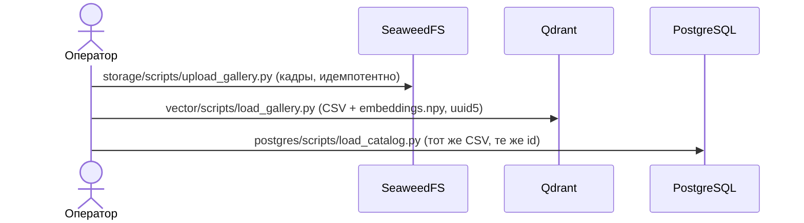

# Архитектура решения

Документ описывает функциональную и компонентную архитектуру (ТЗ п. 12, первый пункт). Метод обработки данных и алгоритмы вынесены в [`methods.md`](methods.md), детали backend и inference в [`backend.md`](backend.md), интерфейс в [`frontend.md`](frontend.md), масштабирование по объёму данных (с графиками и открытыми бенчмарками) — в [`scaling.md`](scaling.md).

**Статус реализации.** Документ сверен с кодом на коммите `60fc04e` (26.09.2026). В репозитории есть все шесть сервисов: frontend, backend, inference, Qdrant, SeaweedFS, PostgreSQL, а также схемы, скрипты загрузки, сборка образов и резервное копирование. Сквозной сценарий (интерфейс → backend → inference → хранилища) на живом стеке в рамках сверки **не проверялся**; в коде найден ряд расхождений, которые могут его ломать: они собраны в [`backend.md`, раздел 8](backend.md#8-известные-расхождения-и-дефекты). Расхождения, важные для архитектуры, отмечены ниже словом «Расхождение».

## 1. Функциональная архитектура

ТЗ п. 4 делит работу сервиса на четыре последовательных этапа. Ниже показано, какой компонент за какой этап отвечает.

| Этап (ТЗ п. 4) | Что происходит | Компонент | Статус |
|---|---|---|---|
| Получение | приём кадра JPEG/PNG и BBox `(x, y, w, h)` в пикселях исходного кадра, базовая валидация | frontend → backend | реализовано; проверяются тип, размер до 50 МБ и выход рамки за правый и нижний край, знак `x, y, w, h` не проверяется |
| Обработка | вырезка объекта по BBox, эмбеддинг float32 размерности 512 | inference (DINOv3 ViT-L/16 + LoRA + голова BNNeck) | реализовано; классификации атрибутов (опционально по ТЗ) нет |
| Анализ | векторный поиск по галерее, косинусное сходство | Qdrant (HNSW) | реализовано |
| Результат | сортировка по убыванию близости, топ-N; при уверенности ниже порога отказ | backend + Qdrant + PostgreSQL | реализовано; отказ определяется на backend (`accepted = score ≥ порог`), выдача содержит все top-N с флагом |

Пользовательские сценарии (экраны интерфейса):

| Экран | Назначение | Данные |
|---|---|---|
| Поиск | загрузить кадр, отметить автомобиль рамкой, получить кандидатов или отказ, открыть карту внимания («Grad-CAM») | запрос → backend |
| Галерея | просмотр объектов галереи, добавление одного объекта, импорт ZIP + CSV | PostgreSQL (каталог), SeaweedFS (кадры) |
| Метрики и порог | KPI, кривая Precision/Recall/F1/TNR, выбор порога отказа | `metric_runs`, `threshold_history` |
| История | прошлые запросы, отказы, повтор при другом пороге | `search_queries`, `search_results` |
| Экспорт | `submission.csv`, `embeddings.npy`, `candidates.csv` (ТЗ п. 8) | `export_jobs` |

Принцип: **один порог отказа на всё**. Он хранится в PostgreSQL (`threshold_history`, действующий порог в представлении `current_threshold`) и одинаково действует на поиск, метрики и экспорт. Рабочее значение на экране меняется ползунком, в БД оно попадает только кнопкой «Сохранить» на «Метриках».

## 2. Компонентная архитектура

```
                          ┌───────────────────────────── сеть docker: falcon-reid ─────────────────────────────┐
браузер ──HTTP:8080──> [frontend nginx] ──/api, /docs, /redoc, /openapi.json──> [backend :8000] ──> [inference :8001]
                                                                                   │                  DINOv3 + LoRA, GPU
                                        ┌──────────────────────────────────────────┼──────────────────────────┐
                                        v                                          v                          v
                                  [qdrant :6333/6334]                      [seaweedfs :8333 S3]         [postgres :5432]
                                  векторы + payload                        кадры галереи и запросов,    метаданные, порог, история,
                                  volume qdrant-data                       файлы экспорта               задания
                                                                           volume seaweedfs-data        volume postgres-data
```

| Компонент | Каталог | Образ | Роль | Наружу |
|---|---|---|---|---|
| frontend | `frontend/` | сборка из исходников на `nginx-unprivileged:1.27-alpine` | статика UI (Vite + React), прокси `/api`, `/docs`, `/redoc`, `/openapi.json` на backend; `/healthz` | `:8080` |
| backend | `backend/` | `python:3.12-slim` + FastAPI | API `/api/v1`, бизнес-логика, поиск, режим отказа, фоновые задания, OpenAPI (Swagger) | `:8000` на всех интерфейсах (Расхождение: остальные хранилища слушают только `127.0.0.1`) |
| inference | `inference/` | `pytorch/pytorch:2.2.0-cuda12.1-cudnn8-runtime`, `runtime: nvidia` | эмбеддинг по кадру и BBox, карты внимания; веса монтируются томами, в образ не входят | `:8001` на всех интерфейсах, без аутентификации |
| qdrant | `vector/` | `qdrant/qdrant:v1.19.1` | коллекция `gallery`: 512 × float32, Cosine, HNSW; доступ по ключу API | `127.0.0.1:6333`, `:6334` |
| seaweedfs | `storage/` | `chrislusf/seaweedfs:4.47` + entrypoint | S3-бакет `gallery`; две идентичности: `reid-backend` (чтение и запись в бакет) и `admin` | `127.0.0.1:8333` |
| postgres | `postgres/` | `postgres:17-alpine` | схема `reid`; роль `reidbackend` только DML, `reidadmin` только миграции | `127.0.0.1:5432` |
| qdrant-init, postgres-init | там же | тонкие образы | одноразовая инициализация: коллекция и индексы; роль и миграции. Идемпотентны | нет |

Границы ответственности (ТЗ п. 6: независимые компоненты): у каждого компонента свой Dockerfile, compose-файл, переменные окружения и volume (README есть у `frontend`, `vector`, `storage`, `postgres`, `backend`, `inference`). Компоненты общаются только по сети и по именам (`qdrant`, `seaweedfs`, `postgres`, `backend`, `inference`); корневой `docker-compose.yml` лишь собирает их через `include`. Любой компонент запускается и проверяется отдельно из своего каталога.

### Связи между хранилищами

Единый идентификатор объекта галереи: `id = uuid5(NAMESPACE, "image_id:x:y:w:h")`. Он совпадает в Qdrant (id точки) и PostgreSQL (`gallery_objects.id`), поэтому загрузка в обе базы идемпотентна: повторный запуск перезаписывает записи, а не создаёт дубли.

**Расхождение.** Пространство имён в коде не единое: скрипты `vector/scripts/load_gallery.py` и `postgres/scripts/load_catalog.py` используют `6f0f8a3e-5a0e-4c53-9d0a-4f414c4b4c4f`, а backend (импорт, добавление объекта) и `scripts/load_dataset.py` используют `uuid.NAMESPACE_DNS`. Один объект, загруженный разными способами, получит разные `id`. Идентификатор объекта согласован только внутри одного способа загрузки; способы смешивать нельзя, пока пространство имён не будет приведено к одному (`backend.md`, раздел 8, №3).

**Расхождение (новое).** После перехода `images`/`gallery_objects` со `split` на `role`+`batch_id` (backend, migration `003_roles.sql`) скрипт `postgres/scripts/load_catalog.py` пишет в колонку `split`, которой в схеме больше нет, — запуск завершится ошибкой Postgres «column "split" does not exist». `vector/scripts/load_gallery.py` кладёт в payload Qdrant поле `split` вместо `role`/`batch_id` — не приведёт к ошибке, но такие точки не участвуют в поиске backend-а (`search()` фильтрует по `role='gallery'`) и не видны как источник в «Экспорте» (там нужна запись в `import_jobs` с `role`). Оба скрипта, а также `scripts/load_dataset.py` и `scripts/evaluate_api.py` (жёстко зашитые пути `/home/limon/...` и рабочие пароли — см. README, «Известные проблемы») стоит удалить: рабочий путь загрузки данных — импорт через `/gallery/import-sessions` (UI «Галерея» или `docker compose run backend python -m app.cli submit`, `scripts/submit.sh`).

| Хранилище | Ключ | Содержимое |
|---|---|---|
| SeaweedFS | backend: `images/<image_id>.jpg` (кадры галереи), `queries/<uuid>.jpg` (кадры запросов), `exports/<job_id>/<файл>` (экспорт); скрипт `storage/scripts/upload_gallery.py` кладёт кадр по ключу `<имя файла>` без префикса `images/` | кадр в исходном разрешении (**Расхождение** схем ключей, `backend.md`, раздел 8, №4) |
| Qdrant | `id`; payload от backend: `image_id`, `bbox`, `vehicle_id`, `role`, `batch_id` | вектор 512 × float32; `bbox` у скриптов список `[x, y, w, h]`, у backend объект `{x, y, w, h}` |
| PostgreSQL | `images`, `gallery_objects` (`id`, `image_id`, bbox, `vehicle_id`, `role`, `batch_id`, `row_no`) | каталог; `row_no` заполняет и backend (при импорте), и скрипт `load_catalog.py` |

### Модель данных PostgreSQL (схема `reid`)

| Таблица | Назначение |
|---|---|
| `images`, `gallery_objects` | каталог кадров и объектов; `role` ∈ gallery, query, val_gallery, val_query; `batch_id` — партия импорта (`import_jobs.id`), NULL для ручного «Добавить ТС» |
| `threshold_history`, представление `current_threshold` | журнал порога с обоснованием; append-only для backend; до калибровки действует значение по умолчанию 0,70 |
| `search_queries` | запрос: bbox, порог на момент запроса, лучшее сходство, признак отказа (`refused`, вычисляется), время ответа, версия модели, эмбеддинг `real[512]`, ключ кадра запроса |
| `search_results` | все top-N кандидатов запроса с `score` и флагом `accepted` (сходство не ниже порога): видно, насколько близко к порогу был отказ |
| `metric_runs` | mAP, Rank-1, Rank-5, F1, TNR, «PR-AUC» для выборки и порога, кривая по порогам в `details.curve` |
| `import_jobs` | задание импорта галереи: статус, прогресс, счётчики (`002_import_jobs.sql`) |
| `metric_jobs` | задание оценки метрик: статус, прогресс, ссылка на `metric_runs` (`002_import_jobs.sql`) |
| `export_jobs` | задание экспорта: статус, порог, список файлов |

Миграции лежат в `postgres/migrations/` (`001_init.sql`, `002_import_jobs.sql`, `003_roles.sql` — split → role/batch_id, `004_export_gallery_pool.sql` — экспорт больше не требует отдельной партии-галереи), применяются `postgres-init` при каждом старте (применённые записаны в `public.reid_migrations`).

## 3. Ключевые сценарии

### Загрузка галереи

Есть два пути, **которые не совместимы между собой** (см. выше про идентификаторы и ключи S3).

1. **Через интерфейс и backend** (экран «Галерея»): один объект (`POST /gallery/objects`) или ZIP + CSV (`POST /gallery/imports`): backend сам считает эмбеддинги через inference и пишет в SeaweedFS, Qdrant и PostgreSQL. Ожидаемо не работает из-за `CHECK (width > 0)` в схеме `images` (`backend.md`, раздел 8, №2).
2. **Скриптами оператора** (нужен готовый `embeddings.npy`): `storage/scripts/upload_gallery.py`, `vector/scripts/load_gallery.py`, `postgres/scripts/load_catalog.py`. Инструмента, который считает `embeddings.npy` по кадрам **до** загрузки, в репозитории нет (backend умеет только выгружать `embeddings.npy` из уже заполненной коллекции, `backend.md`, раздел 6.6).

Третий путь: `scripts/load_dataset.py` (черновой скрипт разработчика; закодированы локальные пути и учётные данные, читает кадры из `/data/images` внутри контейнера inference, который в compose не смонтирован). В документах решения он как рабочий способ не описывается.



### Поиск с режимом отказа

```mermaid
sequenceDiagram
    actor Оператор
    participant UI as Frontend
    participant B as Backend
    participant I as Inference
    participant PG as PostgreSQL
    participant Q as Qdrant
    participant S3 as SeaweedFS
    Оператор->>UI: кадр + рамка BBox
    UI->>B: POST /api/v1/queries (изображение, x, y, w, h, top_n, threshold, rerank)
    B->>B: валидация (тип, размер, рамка)
    B->>S3: кадр запроса → queries/<uuid>.jpg
    B->>I: POST /internal/embed (кадр + рамка)
    I-->>B: эмбеддинг 512
    B->>Q: query_points(limit=N), без score_threshold
    Q-->>B: top-N со score (все, включая ниже порога)
    B->>B: accepted = score ≥ порог; отказ, если принятых нет
    B->>PG: запись search_queries и search_results
    B-->>UI: top-N с флагом accepted (отказ = ни одного принятого)
    UI->>B: GET /objects/{id}/crop, /queries/{id}/crop (миниатюры)
    B->>S3: кадры → вырезка по BBox
```

Порог передаётся в Qdrant **не** как `score_threshold`: backend ищет без порога, чтобы вернуть кандидатов ниже порога («отказ» показывается вместе с лучшим кандидатом и его сходством). Прежняя версия схемы с `score_threshold=τ` не соответствует коду. Группировки по `vehicle_id` при поиске нет: несколько мест в top-N могут занять снимки одного автомобиля.

### Выбор порога

Порог подбирается по кривой последнего запуска оценки (экран «Метрики и порог», рекомендованный порог считается в браузере: максимум F1 при TNR не ниже выбранного значения) и фиксируется записью в `threshold_history` кнопкой «Сохранить»; в `reason` идёт короткое описание (запуск, версия модели, F1 и TNR). Действует он везде. **Расчёт метрик в backend пока не соответствует методике** ([`methods.md`](methods.md), раздел «Порог отказа», и `backend.md`, раздел 8, №5), поэтому обоснованного порога нет: действует значение по умолчанию 0,70.

## 4. Развёртывание и эксплуатация

- **Запуск:** `./run.sh` (сборка образов из Dockerfile с интернетом; `--registry`: образы из GitLab Registry без сборки; далее генерация секретов, запуск хранилищ, инициализация, запуск приложения). `SKIP_SERVICES="inference"` не поднимает inference на машине без GPU или без весов.
- **GPU и веса.** Inference запускается с `runtime: nvidia` и требует NVIDIA Container Toolkit; веса (около 900 МБ: `inference/weights/dinov3-vitl16-bf16/` и `JDNFV_MASKED_FT_best_fp16.pt`) лежат в репозитории через Git LFS и монтируются в контейнер, а **не вшиваются в образ**. Поставка идёт вместе с репозиторием: `git lfs pull` нужен после клонирования.
- **CI/CD:** корневой `Jenkinsfile` (проверки, сборка семи образов быстрой ветки и отдельная сборка inference, smoke на агенте без inference, публикация в GitLab Registry, деплой на aquila через `./run.sh --registry`, при деплое веса переносятся из предыдущего выката или загружаются из LFS); порядок в [README](../README.md#cicd-и-деплой-на-aquila). Дымовые проверки `scripts/smoke.sh` общие для разработчика, CI и деплоя. Подробная инструкция в [`README.md`](../README.md#пошаговая-инструкция-запуска).
- **Без интернета при запуске:** сборке нужен интернет (базовые образы, npm, pip). Собранные образы `postgres`, `qdrant`, `seaweedfs`, `frontend`, `backend` работают без сети; inference работает без сети, если веса лежат в `inference/weights` (модель из сети не подгружается: код читает только локальные каталоги). Проверка на машине без сети для `backend` и `inference` в рамках сверки **не выполнялась**.
- **Изоляция контейнеров:** `cap_drop: [ALL]`, `no-new-privileges`, `read_only` с tmpfs, не root там, где образ это позволяет, лимиты памяти (`*_MEM_LIMIT`; у inference по умолчанию 4 ГБ; сумма лимитов по умолчанию около 7,6 ГБ (потолки, не резервы), стек рассчитан на хост с 8 ГБ RAM, значения в `.env.example`) и процессов, ротация логов 10 МБ × 3.
- **Сеть:** наружу публикуются UI на `:8080`, а также backend `:8000` и inference `:8001` (на всех интерфейсах, без аутентификации; **Расхождение** с тем, что публикуется только UI); БД, S3 и Qdrant слушают `127.0.0.1`, открыть их можно переменными `*_BIND=0.0.0.0` (секреты при этом обязательно свои).
- **Данные:** именованные volume переживают `down`. Резервная копия и восстановление: `make backup`, `make restore DIR=…` (холодная копия трёх хранилищ + `pg_dump`).
- **Проверка:** `scripts/smoke.sh` (дымовые проверки поднятого стека: healthy-сервисы, расширения и таблицы PostgreSQL, коллекция Qdrant, бакет S3, frontend, `/api/v1/status` backend, `/health` inference, если он запущен).

## 5. Масштабирование

Развёрнутый разбор с графиками и открытыми бенчмарками HNSW/PostgreSQL — [`scaling.md`](scaling.md).

Для галереи порядка 10^6 объектов заложены приближённый поиск HNSW и скалярная квантизация int8 с рескорингом (`QDRANT_QUANTIZATION=scalar`): расчётно около 0,5 ГБ векторов в RAM против 2,0 ГБ для float32. Цифры расчётные; замер HNSW проведён только на синтетической галерее в 200 000 векторов (`methods.md`, раздел 3), замеры на 10^6 объектов и на стенде организаторов не проводились. Один узел без репликации; Qdrant и SeaweedFS поддерживают кластер, но в поставку он не входит.

Узкие места, видимые в коде: эмбеддинги при импорте считаются по одному объекту через HTTP (пакетные эндпоинты inference есть, backend их не использует); вызовы Qdrant, S3 и inference в backend синхронные внутри асинхронных обработчиков; фоновые задания живут внутри процесса backend. Для 10^6 объектов импорт через интерфейс не рассчитан (лимит nginx на тело запроса 50 МБ).
