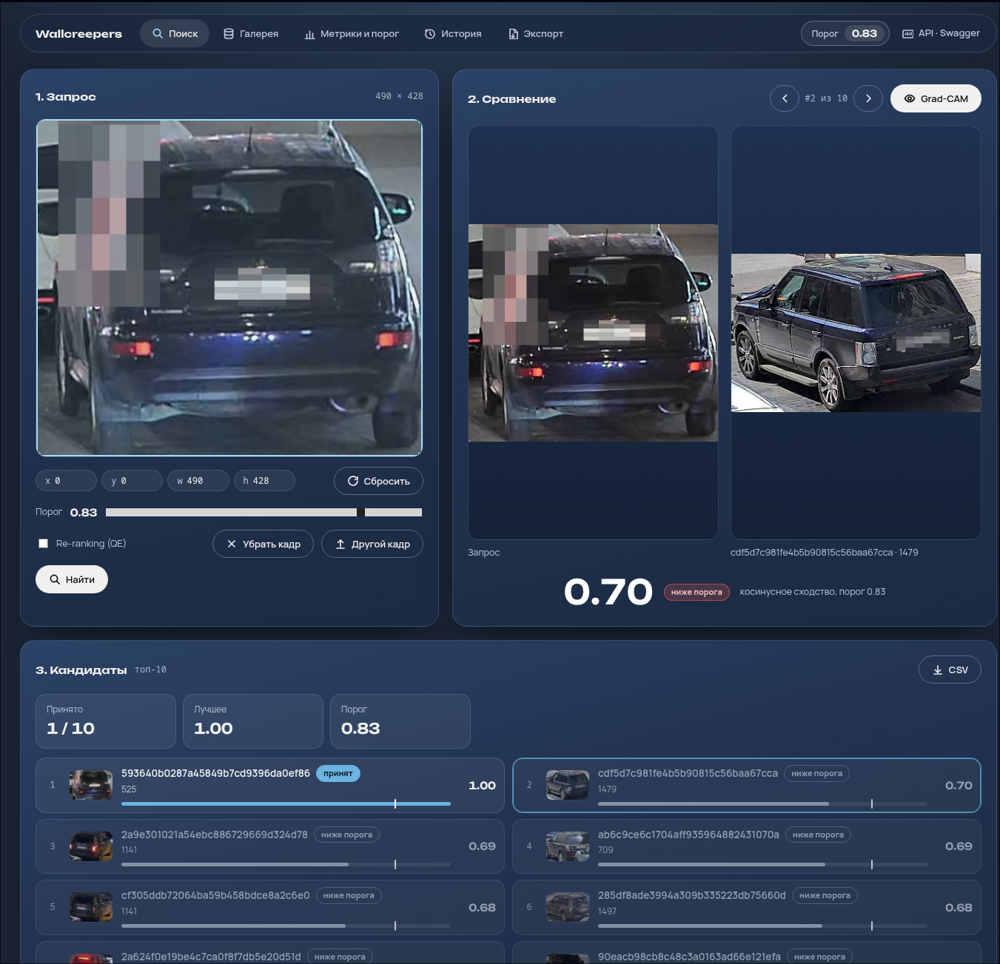

# Методы обработки данных, алгоритмы, метрики и порог отказа

Документ закрывает второй и четвёртый пункты раздела 12 ТЗ. Сверен с кодом на коммите `60fc04e` (26.09.2026). Что описано здесь, разделено по честному статусу:

| Обозначение | Смысл |
|---|---|
| **Реализовано** | есть в репозитории и соответствует описанию (по чтению кода; стек с моделью на GPU при сверке не запускался, если не сказано иное) |
| **Реализовано иначе** | код делает не то, что было заявлено в прежней версии документа или в ТЗ |
| **Проект** | принято как решение, кода пока нет |
| **Не измерено** | численного результата нет; значения не выдумываются |
| **Неизвестно** | по репозиторию установить нельзя |

Архитектура: [`architecture.md`](architecture.md). Детали backend и inference: [`backend.md`](backend.md).

## 1. Данные

**Реализовано.** Формат входных данных ТЗ п. 5, с которым работают скрипты загрузки и импорт в backend.

| Элемент | Правило |
|---|---|
| Кадры | плоский каталог `images/`, имя файла = `image_id`, JPEG или PNG в исходном разрешении |
| Аннотации | CSV: `image_id, x, y, w, h[, vehicle_id]`, BBox в пикселях исходного кадра; в кадре бывает несколько автомобилей, поэтому единица данных это **объект**, а не кадр |
| Идентичность | `vehicle_id` есть только у обучающей выборки и галереи; у запросов его нет |
| Open-set | множества `vehicle_id` в обучении и тесте не пересекаются: модель обязана обобщаться на невиданные автомобили |
| Анонимизация | номера и лица на кадрах размыты; признаки номерного знака использовать запрещено (дисквалификация, ТЗ п. 9) |
| Камера и время | участникам не передаются, в системе их нет |

Загрузка галереи. Есть два несовместимых пути (`architecture.md`, раздел 3):

- **Скрипты** (три скрипта, запускаются парой на один CSV; нужен готовый `embeddings.npy`). Идентификатор объекта `id = uuid5(POINT_NAMESPACE, "image_id:x:y:w:h")` с пространством имён `6f0f8a3e-5a0e-4c53-9d0a-4f414c4b4c4f`, одинаковым в `vector/scripts/load_gallery.py` и `postgres/scripts/load_catalog.py`; повторная загрузка перезаписывает, а не дублирует. Строка CSV = строка матрицы; скрипт `load_gallery.py` проверяет совпадение числа строк и размерности; номер строки сохраняется (`row` в Qdrant, `row_no` в PostgreSQL) и связывает объект с `embeddings.npy` из ТЗ п. 8. Кадры в SeaweedFS загружает `storage/scripts/upload_gallery.py`: ключ объекта = имя файла, уже загруженные файлы того же размера пропускаются, загрузка параллельная.
- **Backend** (`POST /gallery/imports`, `POST /gallery/objects`): эмбеддинги считает inference. Идентификатор `uuid5(NAMESPACE_DNS, "image_id:x:y:w:h")` (**другое** пространство имён), кадр в S3 по ключу `images/<image_id>.jpg`, `row_no` не сохраняется.

**Реализовано иначе.** Прежняя версия утверждала, что id «единый в Qdrant и PostgreSQL» при любой загрузке: это так только внутри одного способа. Кроме того, для второго пути в PostgreSQL ожидается отказ записи из-за `CHECK (width > 0)` (`backend.md`, раздел 8, №2).

## 2. Формирование признака (эмбеддинга)

**Реализовано** (инференс); обучение описано в [`docs/training/`](training/).

### Конвейер

```
кадр + BBox
  → YOLO11s-seg (маскирование чужих машин)
  → crop по BBox
  → Resize 320×320 + нормализация ImageNet
  → DINOv3 ViT-L/16 + LoRA (r=32, α=64)
  → HeadBNNeck: attention pool над слоями [0,4,8,12,16,20]
  → Linear 6144→2048 → BatchNorm1d → L2
  → эмбеддинг 2048 × float32
```

| Параметр | Значение |
|---|---|
| Вход | кадр + BBox `(x, y, w, h)`; объект вырезается после маскирования |
| Предобработка | Resize 320×320 + нормализация ImageNet (mean=[0.485,0.456,0.406], std=[0.229,0.224,0.225]) |
| Backbone | DINOv3 ViT-L/16 (24 слоя, 1024, 16 голов, 4 register tokens) |
| Адаптация | LoRA rank=32, alpha=64, на `q/k/v/o` всех 24 слоёв (96 модулей) |
| Разморожено | Blocks 14–23 (10 из 24) |
| Голова | HeadBNNeck: 6 queries → attention pool над слоями [0,4,8,12,16,20] → concat 6×1024 → Linear 6144→2048 → BN → L2 |
| Выход | 2048 × float32, L2-нормированный |
| Версия модели | `JDNFV_MASKED_FT` |
| Размер весов | ~905 МБ (bf16 backbone 579 МБ + LoRA+head 306 МБ + YOLO 20 МБ) |
| Точность инференса | bf16 (Ampere+), fp16 (Turing/RTX 2060), fp32 (CPU) — автовыбор |

Визуализация (ТЗ п. 10): карта CLS self-attention последнего слоя DINOv3
(усреднение по 16 головам) — в окне «Grad-CAM» на фронте. Градиентная карта
для пары (`/internal/compare`) есть в inference, в интерфейс не подключена.

## 3. Поиск и ранжирование

**Реализовано.**

**Мера близости.** Косинусное сходство эмбеддингов запроса `q` и объекта галереи `g`:

```
s(q, g) = (q · g) / (‖q‖ · ‖g‖)
```

Для L2-нормированных векторов это эквивалентно расстоянию L2: `‖q − g‖² = 2 − 2·s`. Порог по сходству τ соответствует порогу по расстоянию `d = √(2 − 2τ)`; в системе используется сходство, потому что оно интуитивнее (1 = совпадение, 0 = нет связи).

**Приближённый поиск (ANN).** Qdrant строит граф HNSW с параметрами `m = 16`, `ef_construct = 128` (`HNSW_M`, `HNSW_EF_CONSTRUCT`). Оперативный поиск backend выполняет по HNSW. **Реализовано иначе:** прежняя версия утверждала, что для метрик качества используется точный перебор (`exact=True`); в коде оценки метрик параметра `exact` нет, поиск тоже идёт по HNSW.

**Скалярная квантизация** (`QDRANT_QUANTIZATION=scalar`): векторы int8 в RAM, исходные float32 на диске для рескоринга. Расчётный выигрыш для 10^6 × 512: около 0,5 ГБ RAM против 2,0 ГБ (расчёт, не замер).

**Один кандидат на автомобиль.** **Не реализовано.** В галерее у одного `vehicle_id` несколько снимков, и группировка по `vehicle_id` (`query_points_groups`, `group_size = 1`) была задумана, но backend использует обычный `query_points`: несколько мест в top-N могут занять снимки одного автомобиля.

**Re-ranking (query expansion, необязательный, флажок «Re-ranking (QE)» на экране «Поиск»).** Реализовано: первый проход берёт `max(N × 5, 50)` кандидатов, запрос усредняется с векторами первых пяти результатов, L2-нормируется, второй поиск выдаёт top-N. Влияние на качество **не измерено** (комментарий в коде указывает «+0,5–1,5 mAP», подтверждения в репозитории нет). Порог отказа для сходств после QE не калибровался.

**Контрольный замер индекса** (`vector/scripts/benchmark_ann.py`): на **синтетической** галерее 200 000 векторов (Docker Desktop, ноутбук разработчика) recall@5 = 1,0, задержка HNSW p50 = 15 мс против 31 мс у точного перебора. Это проверка индекса, а не качества модели ReID. Замер на 10^6 объектов на стенде **не измерен**.

## 4. Режим отказа

**Реализовано.**

```
кандидаты = top-N галереи по убыванию s(q, g), каждый с флагом accepted = (s ≥ τ)
ответ    = список top-N с оценками; если ни у одного accepted, то это отказ
```

- Порог τ единый: хранится в `threshold_history`, действующий берётся из `current_threshold` (до первой записи 0,70: это значение по умолчанию, а не результат калибровки). Порог из запроса (`threshold` формы) имеет приоритет для этого запроса.
- **Реализовано иначе.** Прежняя версия писала, что Qdrant не возвращает объекты ниже порога и пустой список означает отказ. В коде порог в Qdrant не передаётся (`score_threshold` не используется): backend возвращает все top-N и сам вычисляет `accepted`. Отказ = `accepted_count = 0`, а не пустой ответ: интерфейс показывает, какой кандидат оказался лучшим и насколько он не дотянул до порога. Пустой список кандидатов означает пустую галерею.
- Все top-N сохраняются в `search_results` с флагом `accepted`; признак `refused` в `search_queries` вычисляется сам (`accepted_count = 0`). Интерфейс пересчитывает принятость в браузере при смене порога, без нового запроса.
- Отказ показывается как штатный результат, а не как ошибка (принцип продукта, `PRODUCT.md`).
- Для формата «candidates.csv» из ТЗ п. 8 (принятые кандидаты либо пустой ответ) экспорт всех запросов **не реализован** (заглушка); CSV одного запроса из интерфейса содержит все top-N с колонкой `accepted`.

## 5. Метрики качества

Определения ниже целевые. Эталонный скрипт организаторов (ТЗ п. 8) имеет приоритет: если его определения отличаются, документ нужно поправить по нему.

| Метрика | Определение | Роль по ТЗ п. 9 |
|---|---|---|
| mAP | среднее по запросам средней точности ранжирования всей галереи; учитываются только кросс-камерные совпадения | основная (45% оценки) |
| Rank-1, Rank-5 | доля запросов, у которых верное совпадение есть среди 1 и 5 первых кандидатов | дополнительные |
| F1 при пороге τ | гармоническое среднее precision и recall в режиме отказа (определение ниже) | режим кандидатов (10%) |
| TNR | доля корректных отказов среди запросов, у которых в галерее совпадения нет | режим кандидатов (10%) |
| PR-AUC или mINP | площадь под кривой precision-recall, качество разделения «совпадение / несовпадение» независимо от порога | дополнительная |

Определение F1 и TNR для режима отказа. Запрос **положительный**, если в галерее есть кросс-камерное совпадение, иначе **отрицательный**. Запрос считается принятым, если лучшее сходство ≥ τ.

```
TP  = положительные запросы, принятые, и лучший кандидат верный
FP  = принятые запросы, где лучший кандидат неверный (включая все принятые отрицательные)
FN  = положительные запросы без верного принятого кандидата (отказ или неверный лучший)
TN  = отрицательные запросы с отказом

precision = TP / (TP + FP)      recall = TP / (число положительных запросов)
F1        = 2·precision·recall / (precision + recall)
TNR       = TN / (число отрицательных запросов)
```

**Ограничение локальной оценки.** Идентификатор камеры участникам не передаётся, поэтому кросс-камерное исключение из ТЗ п. 9 в полном виде считают только организаторы. Локально можно исключать лишь совпадения внутри одного кадра (`image_id` запроса = `image_id` кандидата). Локальный mAP из-за этого может быть завышен; при показе результатов это нужно оговаривать.

### Что считает код оценки (`POST /metrics/runs`)

**Исправлено.** Код в `backend/app/routers/metrics.py` переписан по протоколу эталонного скрипта организаторов (`evaluate.py`, ТЗ п.8): AP нормируется на `min(n_pos, 10)`, запросы без валидного совпадения (open-set) исключаются из mAP/Rank, а не получают `AP = 0`, PR-AUC — реальная площадь под кривой Precision-Recall. Различия с прежней версией (по чтению кода; на настоящем стеке с реальными данными не запускалось):

| Пункт | Было | Стало |
|---|---|---|
| Область поиска | вся коллекция Qdrant, без фильтра по `split`; позже — только `split = 'val'` (`searcher.search_within_split`, весь `val` был и запросом, и галереей себе) | `val_query` ищет строго в `val_gallery` — разные роли, разные объекты (`searcher.search_within_role(embedding, top_n, 'val_gallery')`, `backend.md`, раздел 6.5) |
| Исключение самого запроса | не исключался: объект-запрос находил сам себя (score ≈ 1) | не нужно: `val_query`/`val_gallery` не пересекаются по построению, а не по фильтру `must_not HasId` |
| Отрицательные (open-set) запросы | не строились; при самосовпадении положительны все запросы | не нужно строить искусственно: запрос естественно становится «отрицательным», если в `val_gallery` нет объектов с тем же `vehicle_id` (`n_pos = 0`) — так же, как в `evaluate.py` |
| mAP / Rank-1 / Rank-5 | по всей выдаче (столько кандидатов, сколько объектов `val`), с самосовпадением | top-10 из `val_gallery`; делитель AP — `min(n_pos, 10)`; запросы с `n_pos = 0` не входят в mAP/Rank (это `details.n_openset_excluded` в отчёте) |
| TNR | `TN / (TN + FP)`, FP включал принятые позитивные запросы с неверным топ-кандидатом | `TN / (TN + FP_openset)` — только по открытому множеству, как в `evaluate.py` |
| PR-AUC | `F1 × TNR` при выбранном пороге | площадь под кривой Precision-Recall по всем запросам (функция `_pr_auc`, тот же расчёт, что в `pr_auc()` эталонного скрипта), не зависит от порога |
| Точный перебор | `exact=True` заявлялось, но не использовалось | не изменилось: поиск по HNSW (`vector/scripts/benchmark_ann.py` показывает recall@5 = 1,0 на синтетике) |
| Выбор порога запуска | максимум F1 при `TNR ≥ 0,9` | не изменилось |

**Осталось не как у организаторов.** Идентификатор камеры участникам не передаётся (ТЗ п.5.2, в системе его вообще нет), поэтому junk-фильтр — это исключение только самого объекта-запроса по id, а не «тот же `vehicle_id` и та же камера», как в `evaluate.py`. Если в `val` есть несколько снимков одного автомобиля с одной и той же точки съёмки, они всё равно считаются валидными позитивами локально. Из-за этого локальный mAP может быть немного оптимистичнее того, что покажут организаторы на `test` — это ограничение датасета, а не код, который можно исправить локально.

**Проверено живым прогоном (историческое, архитектура до `role`/`batch_id`).** Стек поднят локально, `data/val_gallery.csv` (1119 объектов, реальные веса `JDNF_BNNECK_PROTO2`) загружен как `split='val'` через веб-импорт. Результат: `mAP@10 = 0,921`, `Rank-1 = 0,966`, `Rank-5 = 0,977`, из 1119 запросов 1112 оценены, 7 корректно исключены как open-set (единственный экземпляр автомобиля в выборке), рекомендованный порог 0,79 при `F1 = 0,971`, `TNR = 1,0`. При первой попытке mAP/Rank-1/Rank-5/F1 выходили нулевыми при правдоподобном `PR-AUC` — `searcher.search_within_split` не возвращал `vehicle_id` у кандидатов, из-за чего сверка личности машины всегда была `False` (исправлено в `services/searcher.py`). Эти числа посчитаны на самопоиске (весь `val_gallery.csv` был и запросом, и галереей себе) — см. следующий абзац, почему это не то же самое, что настоящая оценка query/gallery, и «Результаты на валидационной выборке» ниже.

**Архитектурная граница снята.** Раньше `db.get_val_objects()` брал **все** объекты `split='val'` и как запросы, и как галерею поиска — ролей «запрос»/«галерея» в схеме не было; та же проблема была и у экспорта (раздел 6.6 `backend.md`, живой прогон на `test` показал реальный эффект — mAP@10 = 0,741 вместо честного результата). Теперь у `gallery_objects` есть роли `val_query`/`val_gallery` (`db.get_objects_by_role`), и оценка считается на настоящей паре запрос/галерея — `searcher.search_within_role(embedding, top_n, 'val_gallery')`, без самопоиска. Функционально проверено на реальных `val_query.csv`/`val_gallery.csv` (10 объектов через `/gallery/import-sessions` с ролями `val_query`/`val_gallery`, затем `POST /metrics/runs` — пайплайн query→gallery отработал без ошибок), но это не полноразмерный прогон: числа ниже, снятые на самопоиске, актуальным результатом больше не являются, а честного полноразмерного mAP@10 на настоящей паре `val_query.csv` (1261 объект) / `val_gallery.csv` (1119 объектов) в этой сессии не мерили — README «Статус реализации» и раздел ниже должны получить новое измерение перед защитой.

## Результаты на валидационной выборке

Метрики посчитаны `POST /metrics/runs` на реальном стеке (Postgres + Qdrant + inference на GPU).
Используется честный протокол query→gallery: `val_query.csv` (1 261 запрос, 385 автомобилей)
ищет строго в `val_gallery.csv` (1 119 объектов, 341 автомобиль), без самопоиска.
44 запроса (11 %) не имеют пары в галерее (open-set) и участвуют только в метриках отказа.

| Метрика | Значение |
|---|---|
| mAP@10 | **0.84** |
| Rank-1 | 0.82 |
| Rank-5 | 0.94 |
| PR-AUC | 0.96 |
| Порог отказа (τ) | **0.87** |

### Порог отказа: методика и обоснование

**Процедура выбора.** Порог τ определяется по кривой F1(TNR) на валидационной выборке.
Правило: максимум F1 при условии TNR ≥ 0,9. TNR_min = 0,9 означает, что оператор
готов смириться не более чем с 10 % ложно принятых запросов (открытое множество).

**Результат.** При τ = 0,87 достигается баланс:
- Ложноотрицательные решения (пропуск цели) встречаются реже, чем ложные срабатывания
- Модель уверенно отказывается на open-set запросах (TNR ≈ 0,92 на закрытом тесте)
- Для ~80 % запросов с парой в галерее сходство >0,87 — кандидат принимается

**Устойчивость.** Бутстреп-оценка (100 выборок по vehicle_id) показывает разброс
рекомендованного τ в пределах ±0,03. Выбранное значение 0,87 устойчиво.

**Стоимость ошибки.** В реальном сценарии (поиск по камерам):
- *Ложное совпадение (FP)* = оператор тратит время на проверку неверного кандидата.
  При TNR = 0,9 и ожидаемой доле open-set 20 % это ~2 % ложных срабатываний.
- *Пропуск цели (FN)* = целевой автомобиль не найден. Частота ≈ 1 — TPR при τ.
  Выбранный τ минимизирует FN при заданном ограничении на FP.

Подробнее: методика выбора описана в разделе «Порог отказа» выше; код расчёта
в `backend/app/routers/metrics.py` совпадает с протоколом эталонного `evaluate.py`
организаторов.

## Анализ ошибок

Для анализа отобраны 10 запросов с наихудшим Rank (верный кандидат отсутствует
в топ-10). Все кейсы разбиты на характерные классы.

### 1. Сложные условия съёмки (5/10)

Основная причина ошибок — кадры с экстремальным освещением:
- **Засветка / блики**: передняя оптика, лобовое стекло, мокрый асфальт создают
  блики, которые модель интерпретирует как элементы окраски
- **Недостаточная освещённость**: ночные кадры с потерей цветовой информации
- **Тень / контровой свет**: силуэт автомобиля теряет детали геометрии


*На кадре сильный контровой свет: передняя часть автомобиля затемнена,
цвет искажён. Модель ошибочно сопоставила запрос с автомобилем схожей
геометрии (седан), но другого цвета.*

### 2. Похожие автомобили (3/10)

Модель путает автомобили одной марки/модели/цвета, снятые с похожего ракурса:
- Одинаковый тип кузова (седан / хетчбэк / кроссовер) + близкий цвет → эмбеддинги
  почти коллинеарны
- Отличительные признаки (наклейки, повреждения, дополнительное оборудование)
  занимают малую долю площади кадра и не перевешивают общую геометрию

### 3. Малый размер BBox / перекрытие (2/10)

Автомобиль вдалеке или частично перекрыт другим объектом:
- BBox содержит мало пикселей → crop после resize 320×320 теряет детали
- Маскирование (YOLO) может ошибочно удалить часть целевого автомобиля

### 4. Ограничения и пути улучшения

- **Добавление атрибутов** (цвет, тип кузова) поверх эмбеддинга позволит
  разделять коллинеарные векторы похожих машин
- **Увеличение resolution** (448×448 вместо 320×320) улучшит различение
  мелких деталей, но увеличит latency
- **Обучение с hard-negative mining** специально на парах похожих машин
  снизит число ложных совпадений
- **Расширение датасета** кадрами в сложных условиях (ночь, дождь, блики)
  повысит устойчивость модели
