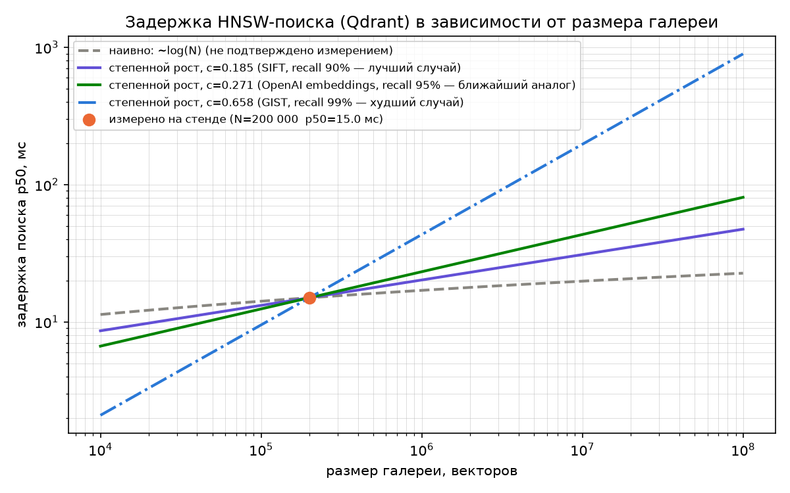
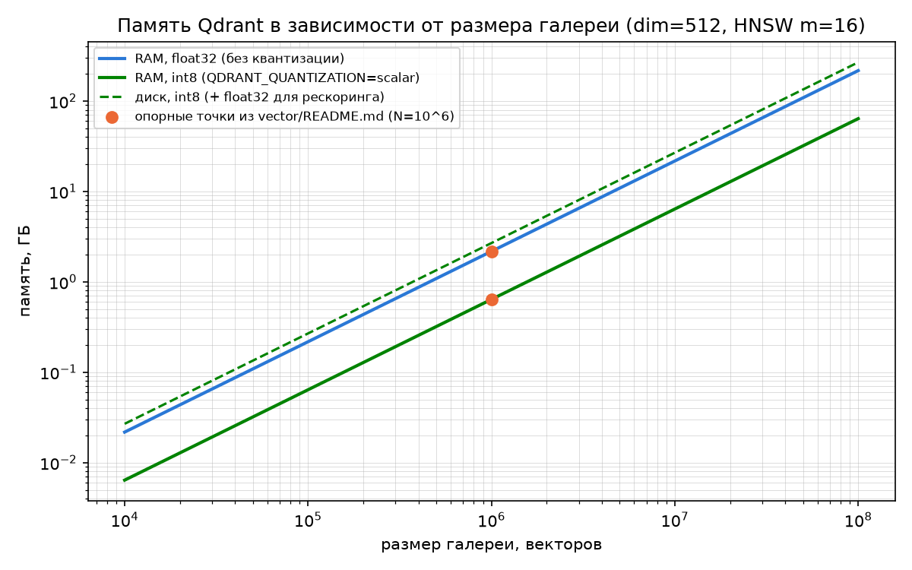

# Масштабирование по объёму данных

Документ разворачивает раздел [«5. Масштабирование»](architecture.md#5-масштабирование) `architecture.md` и раздел «Масштабирование (ТЗ п.10)» [`vector/README.md`](../vector/README.md): на что можно рассчитывать при росте галереи с текущих контрольных 200 000 объектов до 10⁶ (цель ТЗ п.10) и дальше. Сверен с кодом на коммите `8c3a2a1` (28.09.2026).

| Обозначение | Смысл |
|---|---|
| **Измерено** | цифра получена прогоном на нашем стенде |
| **Открытые данные** | цифра перенесена из независимо опубликованного исследования — другие данные, другое железо, другая размерность вектора |
| **Расчёт** | арифметика по формуле (не эксперимент, не перенос чужого измерения) |

Смешивать эти три категории как одинаково надёжные не следует; ниже они разведены по разным таблицам и подписаны на графиках.

## 1. Задержка поиска (Qdrant, HNSW)

**Измерено.** Собственный прогон `vector/scripts/benchmark_ann.py` на синтетической галерее 200 000 векторов (Docker Desktop, ноутбук разработчика, `architecture.md`, раздел 5): recall@5 = 1.0, HNSW p50 = 15 мс против 31 мс у точного перебора. Замера на 10⁶ и выше ещё не было.

**Открытые данные.** Расхожее предположение — что задержка HNSW растёт как `log(N)`, то есть почти не растёт с объёмом. Независимое исследование [«Down with the Hierarchy: The 'H' in HNSW Stands for "Hubs"»](https://arxiv.org/pdf/2412.01940) (восемь датасетов, три доведены до 1 млрд точек, recall зафиксирован на каждом уровне) показывает, что в реальности стоимость запроса растёт **степенным законом** `cost ∝ N^c`:

| Датасет | recall 90% | recall 95% | recall 99% |
|---|---|---|---|
| SIFT (128-мерные, лучший случай в исследовании) | 0.185 | 0.209 | 0.265 |
| OpenAI embeddings (обученные плотные векторы — ближайший аналог нашим) | 0.216 | 0.271 | 0.398 |
| GloVe | 0.311 | 0.373 | 0.518 |
| GIST (960-мерные, худший случай в исследовании) | 0.437 | 0.503 | 0.658 |

Ни один датасет исследования не совпадает с нашим (512-мерный эмбеддинг автомобиля, DINOv3 ViT-L/16 + JDNF BNNeck, косинусная метрика): это перенос чужой экспоненты на другие данные и другое железо, а не измерение нашей системы. Из четырёх строк таблицы OpenAI embeddings — единственный обученный плотный эмбеддинг (а не ручные признаки, как SIFT/GIST), поэтому его exponent при recall 95% (`c = 0.271`) взят как основная рабочая оценка; полный диапазон `0.185–0.658` — вилка неопределённости.



Те же кривые, привязанные к измеренной точке (200 000 → 15 мс):

| N, векторов | наивно ~log(N) | c=0.185 (лучший случай) | c=0.271 (рабочая оценка) | c=0.658 (худший случай) |
|---|---|---|---|---|
| 10⁴ | 11.3 мс | 8.6 мс | 6.7 мс | 2.1 мс |
| 2×10⁵ | 15 мс (**измерено**) | 15 мс | 15 мс | 15 мс |
| 10⁶ | 17.0 мс | 20.2 мс | 23.2 мс | 43.3 мс |
| 10⁷ | 19.8 мс | 30.9 мс | 43.3 мс | 196.8 мс |
| 10⁸ | 22.6 мс | 47.4 мс | 80.8 мс | 895.4 мс |

Практический вывод для перехода к 10⁶ (цель ТЗ п.10): по рабочей оценке p50 вырастет примерно в 1.5 раза (15 → ~23 мс), в худшем случае — почти втрое. Ни то, ни другое не катастрофа для интерфейса, но однозначный ответ даёт только реальный прогон `benchmark_ann.py --n 1000000` на стенде — это единственное, что закрывает вопрос на защите.

## 2. Память (Qdrant)

**Расчёт**, по формуле из `vector/README.md`: векторы — `N × dim × 4 байта` (float32) или `N × dim × 1 байт` (int8, `QDRANT_QUANTIZATION=scalar`, `always_ram=True`); граф HNSW добавляет примерно `N × m × 8 байт` (откалибровано по собственной цифре репозитория — «порядка 130 МБ графа при N=10⁶, m=16»); при квантизации на диске нужна ещё исходная float32-копия для рескоринга.



| N, векторов | RAM, float32 (+ граф) | RAM, int8 (+ граф) | диск, int8 (+ float32 для рескоринга) |
|---|---|---|---|
| 2×10⁵ | 0.44 ГБ | 0.13 ГБ | 0.54 ГБ |
| 10⁶ | 2.18 ГБ | 0.64 ГБ | 2.69 ГБ |
| 10⁷ | 21.76 ГБ | 6.40 ГБ | 26.88 ГБ |
| 10⁸ | 217.6 ГБ | 64.0 ГБ | 268.8 ГБ |

В отличие от задержки, память растёт строго линейно — прогнозируется без всяких оговорок про перенос чужих данных. Именно память, а не задержка поиска, первой упирается в потолок однонодового Qdrant: стек рассчитан на хост с 8 ГБ RAM (`architecture.md`, раздел 4), то есть уже 10⁷ без квантизации (22 ГБ) на одной ноде не поместится, а с квантизацией (6.4 ГБ) — всё ещё в рамках.

## 3. PostgreSQL

**Открытые данные + расчёт.** В схеме `reid` (`postgres/migrations/001_init.sql`) объём, привязанный к размеру галереи, — одна строка `gallery_objects` на объект плюс обычные B-tree индексы (`image_id`, `vehicle_id`, `split`). Поиск по B-tree индексу теоретически растёт логарифмически с числом строк; независимые замеры (например, [Percona](https://www.percona.com/blog/benchmarking-postgresql-the-hidden-cost-of-over-indexing/)) показывают, что на практике деградация на таких объёмах приходит не от глубины дерева, а от операционных эффектов: индекс перестаёт помещаться в `shared_buffers`, растёт время `VACUUM`/`REINDEX`. При 10⁶–10⁷ строк `gallery_objects` это не проблема. `search_queries`/`search_results` растут не с галереей, а с числом запросов оператора — независимый и заметно более медленный рост.

## 4. Узкие места не про ANN

Подробности — `architecture.md`, раздел 5. Коротко: эмбеддинги при импорте через backend считаются по одному объекту через HTTP (пакетные эндпоинты inference есть, backend их не использует), вызовы Qdrant/S3/inference синхронные внутри async-обработчиков, лимит тела запроса nginx — 50 МБ. При 10⁶ объектов это упрётся раньше, чем задержка поиска — импорт через интерфейс на такой объём не рассчитан.

## 5. Как перегенерировать графики

```bash
cd vector/scripts
pip install -r requirements.txt
python plot_scaling.py                                    # опорная точка по умолчанию: 200 000 / 15 мс
python plot_scaling.py --results ../../bench_1m.json       # опорная точка из реального прогона benchmark_ann.py
```

`--results` принимает один или несколько JSON-файлов вывода `benchmark_ann.py` и берёт из них запись с наибольшим `gallery_size` как опорную точку — так кривые считаются от свежего измерения, а не от старого прогона на 200 000. `--dim`/`--m` меняют формулу памяти, если изменится `EMBEDDING_DIM` или параметр HNSW `m`.

## Рекомендации

1. Прогнать `benchmark_ann.py --n 1000000` на стенде до защиты — единственный способ подтвердить или опровергнуть диапазон из раздела 1, а не полагаться на перенесённую экспоненту.
2. Включить `QDRANT_QUANTIZATION=scalar` до 10⁶ — уже поддержано, экономит около 1.5 ГБ RAM без потери recall (рескоринг по float32 на диске).
3. Перевести импорт галереи на пакетные эндпоинты inference и сделать вызовы Qdrant/S3 асинхронными — иначе рост данных выразится не в графике задержки поиска, а во времени импорта.
4. Кластер Qdrant/SeaweedFS в текущую поставку не входит, но поддерживается «из коробки» — единственный путь за пределы 10⁷–10⁸ на одной ноде.

## Источники

- [Down with the Hierarchy: The 'H' in HNSW Stands for "Hubs"](https://arxiv.org/pdf/2412.01940) — степенной закон роста стоимости запроса, таблица показателей степени по датасетам
- [Vector Search Benchmarks — Qdrant](https://qdrant.tech/benchmarks/) — официальная формула памяти (векторы + оверхед графа)
- [Benchmarking PostgreSQL: The Hidden Cost of Over-Indexing — Percona](https://www.percona.com/blog/benchmarking-postgresql-the-hidden-cost-of-over-indexing/)
- Внутренние: [`architecture.md`](architecture.md), [`vector/README.md`](../vector/README.md), [`postgres/migrations/001_init.sql`](../postgres/migrations/001_init.sql), [`vector/scripts/benchmark_ann.py`](../vector/scripts/benchmark_ann.py)
